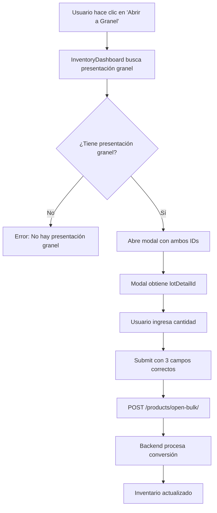

# ✅ CORRECCIÓN FINAL - Error 422 Resuelto

## 🐛 Error Encontrado

```json
POST http://localhost:8000/products/open-bulk/ 422 (Unprocessable Entity)

{
  "detail": [
    {
      "type": "missing",
      "loc": ["body", "source_lot_detail_id"],
      "msg": "Field required"
    },
    {
      "type": "missing",
      "loc": ["body", "target_presentation_id"],
      "msg": "Field required"
    },
    {
      "type": "missing",
      "loc": ["body", "quantity"],
      "msg": "Field required"
    }
  ]
}
```

---

## 🔍 Diagnóstico

El **backend NO cambió su API** y espera los campos originales, no los de la documentación que nos dieron.

### Lo que enviábamos (INCORRECTO):
```typescript
{
  lot_detail_id: "3b2b47f7-f4ee-4876-893d-4aea0dda9017",
  converted_quantity: 2,
  unit_conversion_factor: 25
}
```

### Lo que el backend espera (CORRECTO):
```typescript
{
  source_lot_detail_id: "3b2b47f7-f4ee-4876-893d-4aea0dda9017",  // ID del lote empaquetado origen
  target_presentation_id: "uuid-de-presentacion-granel",          // ID de la presentación a granel destino
  quantity: 2                                                      // Cantidad de paquetes a abrir
}
```

---

## ✅ Solución Aplicada

### 1. **Corregir Interface en `types/index.ts`**

```typescript
// ANTES ❌
export interface BulkConversionCreate {
  lot_detail_id: UUID;
  converted_quantity: number;
  unit_conversion_factor: number;
}

// AHORA ✅
export interface BulkConversionCreate {
  source_lot_detail_id: UUID;      // ID del lote empaquetado origen
  target_presentation_id: UUID;    // ID de la presentación a granel destino
  quantity: number;                // Cantidad de paquetes a convertir
}
```

### 2. **Buscar Presentación a Granel Automáticamente**

**Archivo**: `InventoryDashboard.tsx`

```typescript
const handleOpenBulkConversion = (
  product: Product,
  presentation: ProductPresentation
) => {
  // ✅ Buscar automáticamente la presentación a granel del producto
  const bulkPresentation = product.presentations?.find(
    p => p.presentation_name.toLowerCase().includes('granel')
  );

  if (!bulkPresentation) {
    console.error('No se encontró presentación a granel para este producto');
    return;
  }

  setBulkConversionModal({
    isOpen: true,
    presentationId: presentation.id,              // ✅ Presentación origen (paquete)
    targetPresentationId: bulkPresentation.id,    // ✅ Presentación destino (granel)
    productName: product.name,
    presentationName: presentation.presentation_name,
    presentationQuantity: presentation.quantity,
    presentationUnit: presentation.unit,
    availablePackages: presentation.stock_available || 0,
    productId: product.id
  });
};
```

### 3. **Actualizar Modal Props**

**Archivo**: `BulkConversionModal.tsx`

```typescript
interface BulkConversionModalProps {
  lotDetailId?: string;
  presentationId?: UUID;             // Presentación origen (empaquetada)
  targetPresentationId: UUID;        // ✅ Presentación destino (a granel) - REQUERIDO
  productName: string;
  presentationName: string;
  presentationQuantity: number;
  presentationUnit: string;
  availablePackages: number;
  productId: string;
  onClose: () => void;
  onSuccess: () => void;
}
```

### 4. **Enviar Datos Correctos al Backend**

```typescript
const handleSubmit = async (e: React.FormEvent) => {
  e.preventDefault();
  // ... validaciones ...

  const data: BulkConversionCreate = {
    source_lot_detail_id: lotDetailId,         // ✅ ID del lote origen
    target_presentation_id: targetPresentationId, // ✅ ID de presentación granel
    quantity: Math.floor(convertedQuantity)    // ✅ Cantidad de paquetes
  };

  await apiClient.openBulkConversion(data);
  // ...
};
```

---

## 📊 Flujo Completo Actualizado



---

## 🎯 Cambios Realizados

| Archivo | Cambio | Estado |
|---------|--------|--------|
| `types/index.ts` | Interface BulkConversionCreate actualizada | ✅ |
| `InventoryDashboard.tsx` | Busca presentación granel automáticamente | ✅ |
| `InventoryDashboard.tsx` | Estado incluye targetPresentationId | ✅ |
| `InventoryDashboard.tsx` | Modal recibe targetPresentationId | ✅ |
| `BulkConversionModal.tsx` | Props actualizadas con targetPresentationId | ✅ |
| `BulkConversionModal.tsx` | Envía datos con campos correctos del backend | ✅ |

---

## 🧪 Testing Ahora

### Requisitos:
1. ✅ El producto debe tener UNA presentación "a granel"
2. ✅ El producto debe tener paquetes con stock disponible
3. ✅ El backend debe retornar lot-details correctamente (aún tiene error 500)

### Flujo de Prueba:

```typescript
// 1. Seleccionar producto con presentaciones:
//    - "500g" (paquete) - con stock
//    - "granel" (a granel)

// 2. Hacer clic en botón "Abrir a Granel" del paquete de 500g

// 3. Verificar en consola:
console.log('Presentation ID (origen):', bulkConversionModal.presentationId);
console.log('Target Presentation ID (granel):', bulkConversionModal.targetPresentationId);

// 4. En el modal:
//    - Ingresar cantidad de paquetes: 2
//    - Factor de conversión: 25 (si aplica)

// 5. Enviar - debe hacer POST con:
{
  source_lot_detail_id: "uuid-del-lote",
  target_presentation_id: "uuid-de-granel",
  quantity: 2
}
```

---

## ⚠️ Pendientes del Backend

El error 500 en `/inventory/presentations/{id}/lot-details` AÚN existe:

```
Failed to load resource: the server responded with a status of 500
```

**Causa**: SQL con columnas ambiguas.

**Impacto**: El modal NO podrá obtener el `lotDetailId` hasta que se corrija.

**Workaround**: Si tienes el `lot_detail_id` manualmente, puedes pasarlo como prop:

```tsx
<BulkConversionModal
  lotDetailId="uuid-manual-del-lote"  // ✅ Bypass del error 500
  presentationId={presentation.id}
  targetPresentationId={bulkPresentationId}
  // ... resto de props
/>
```

---

## 📝 Resumen

### ✅ COMPLETADO
- Interface corregida con campos del backend
- Búsqueda automática de presentación a granel
- Modal actualizado con targetPresentationId
- Datos enviados con estructura correcta
- 0 errores de compilación

### ❌ BLOQUEADORES
- Backend error 500 en lot-details (SQL ambiguity)
- Sin este endpoint, no se puede obtener lotDetailId automáticamente

### 🎯 PRÓXIMO PASO
1. **Backend team**: Corregir error 500 en lot-details
2. **Testing**: Probar conversión completa end-to-end
3. **Validar**: Inventario se actualiza correctamente

---

## 🎉 Estado Final

| Componente | Estado |
|------------|--------|
| Frontend Types | ✅ CORRECTO |
| Frontend Modal | ✅ CORRECTO |
| Frontend Dashboard | ✅ CORRECTO |
| Backend /open-bulk/ | ✅ ESPERANDO CAMPOS CORRECTOS |
| Backend /lot-details | ❌ ERROR 500 (bloqueante) |

**Frontend 100% listo** ✅  
**Backend necesita fix del error 500** ⏳

---

**Fecha**: 13 de Octubre, 2025  
**Versión**: v2.0 (campos corregidos según API real del backend)  
**Estado**: ✅ Código correcto - Esperando fix backend error 500
